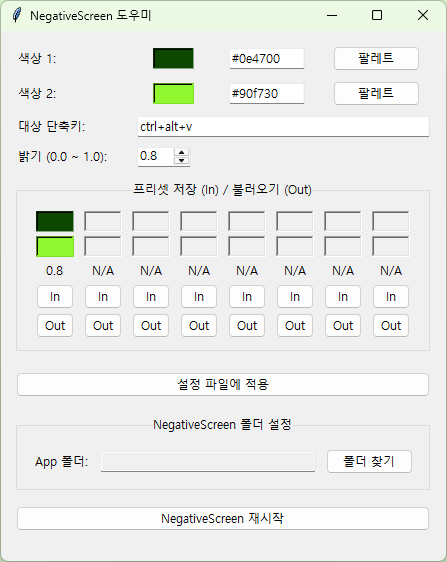
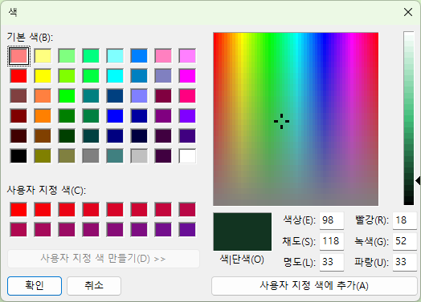

# NegativeScreen - helper v1.0

(NegativeScreen 도우미)

NegativeScreen 프로그램의 `.conf` 설정 파일을 GUI로 쉽게 수정할 수 있도록 돕는 헬퍼 유틸리티입니다.

더 이상 수동으로 복잡한 5x5 색상 변환 행렬(Color Matrix)을 계산하거나, `.conf` 파일을 메모장으로 열 필요가 없습니다. 원하는 두 가지 색상(어두운 색, 밝은 색)과 밝기만 선택하면, 이 프로그램이 자동으로 행렬을 계산하여 `.conf` 파일에 적용하고, NegativeScreen을 재시작해 줍니다.

## 📸 스크린샷

| 기본 화면 | 색상 선택기 |
| :---: | :---: |
|  |  |
| *<small>(helper-01: 프리셋 1개 저장, 폴더 미설정 상태)</small>* | *<small>(helper-02: '팔레트' 버튼 클릭 시)</small>* |

## ✨ 주요 기능

* **자동 행렬 계산**: Hex 코드 또는 팔레트로 두 가지 색상만 선택하면 복잡한 5x5 색상 변환 행렬을 자동으로 계산합니다.
* **밝기 조절**: 0.00 ~ 1.00 사이의 밝기를 0.05 단위로 세밀하게 조절할 수 있습니다.
* **프리셋 저장/불러오기**: 자주 사용하는 8개의 색상/밝기 조합을 저장하고 원클릭으로 불러올 수 있습니다.
* **자동 경로 설정**: NegativeScreen 폴더만 지정하면 `.exe`와 `.conf` 파일을 자동으로 인식합니다.
* **즉시 적용 (재시작)**: "NegativeScreen 재시작" 버튼으로 기존 프로그램을 강제 종료하고 재시작하여 변경 사항을 즉시 반영합니다.
* **설정 자동 저장**: 모든 프리셋과 설정은 `AppData` 폴더에 안전하게 자동 저장되어, `.exe` 파일 위치가 깔끔하게 유지됩니다.

---

## 🚀 설치 및 사용법

### 0. 필수 준비물

이 프로그램은 NegativeScreen의 **설정 파일을 수정**해주는 도우미입니다. **반드시 [NegativeScreen](https://sites.google.com/site/negativescreen/)이 먼저 설치**되어 있어야 합니다.

### 1. 프로그램 다운로드

1.  이 GitHub 저장소의 오른쪽 [**Releases**](https://github.com/dragon8217/my-utils-negativescreen-auto/releases) 탭으로 이동합니다.
2.  최신 버전(v1.0)의 `Assets` 항목에서 `negativescreen-auto.exe` 파일을 다운로드합니다.

### 2. 최초 실행 및 폴더 설정

1.  다운로드한 `negativescreen-auto.exe` 파일을 실행합니다.
2.  맨 아래 "NegativeScreen 폴더 설정" 섹션이 비어있을 겁니다.
3.  **[폴더 찾기]** 버튼을 클릭합니다.
4.  탐색기 창이 뜨면, **NegativeScreen이 설치된 폴더**를 선택합니다.
    * (참고: 해당 폴더에는 `negativescreen.exe`와 `negativescreen.conf` 파일이 반드시 함께 있어야 합니다.)
5.  폴더를 선택하면 경로가 저장되며, 이제 모든 기능을 사용할 준비가 되었습니다. 이 설정은 `AppData`에 저장되어 다음부터는 자동으로 로드됩니다.

### 3. "대상 단축키"의 작동 원리 (매우 중요!)

이 프로그램은 `negativescreen.conf` 파일의 **[단축키]** 문자열을 찾아 그 아래의 행렬을 수정합니다.

1. `negativescreen.conf` 파일 열기
NegativeScreen 폴더의 `negativescreen.conf` 파일을 메모장으로 엽니다. 다음과 같은 구조를 볼 수 있습니다.

    ```
    name_of_matrix=[단축키]
    { 0.11, 0.17, 0.04, 0.00, 0.00 }
    { 0.22, 0.33, 0.08, 0.00, 0.00 }
    { 0.04, 0.06, 0.02, 0.00, 0.00 }
    { 0.00, 0.00, 0.00, 1.00, 0.00 }
    { 0.02, 0.12, 0.00, 0.00, 1.00 }
    ```

2. [단축키] 부분 확인
예를 들어, `.conf` 파일에 `my_preset_green=ctrl+alt+v` 라고 적혀있다면, 여기서 [단축키]는 **`ctrl+alt+v`** 입니다.

3. 프로그램에 입력
우리 프로그램의 **"대상 단축키"** 입력창에, `.conf` 파일에서 확인한 **`ctrl+alt+v`** 를 **똑같이** (대소문자 구분) 입력합니다.

### 4. 설정 적용하기 (일상적인 사용)

1.  **색상 1** (어두운 색), **색상 2** (밝은 색), **밝기**를 원하는 대로 설정합니다.
2.  (선택) **[In]** 버튼을 눌러 이 조합을 프리셋에 저장합니다.
3.  **"대상 단축키"**에 `.conf` 파일에 명시된 단축키 문자열(예: `ctrl+alt+v`)을 입력합니다.
4.  **[설정 파일에 적용]** 버튼을 누릅니다. (이 순간 `.conf` 파일의 해당 매트릭스가 덮어씌워집니다.)
5.  **[NegativeScreen 재시작]** 버튼을 누릅니다.
6.  프로그램이 강제 종료되었다가 다시 켜지며, 방금 설정한 색상으로 변경된 것을 확인할 수 있습니다.

---

## 👨‍💻 개발자용 (Building from Source)

`.exe` 파일 대신 소스 코드를 직접 실행하려면 다음 단계가 필요합니다.

1.  `git clone https://github.com/dragon8217/my-utils-negativescreen-auto.git`
2.  `cd my-utils-negativescreen-auto`
3.  `python -m venv venv`
4.  `.\venv\Scripts\activate`
5.  `python negativescreen-auto.py`
    * (참고: PyInstaller로 빌드하려면 `pip install pyinstaller` 후 `pyinstaller --onefile --windowed negativescreen-auto.py`를 실행하세요.)
